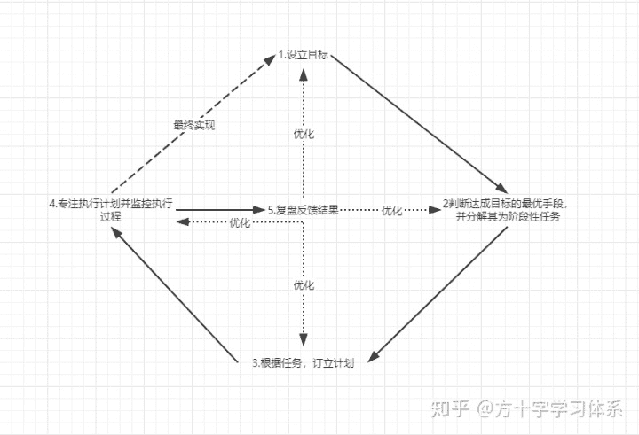
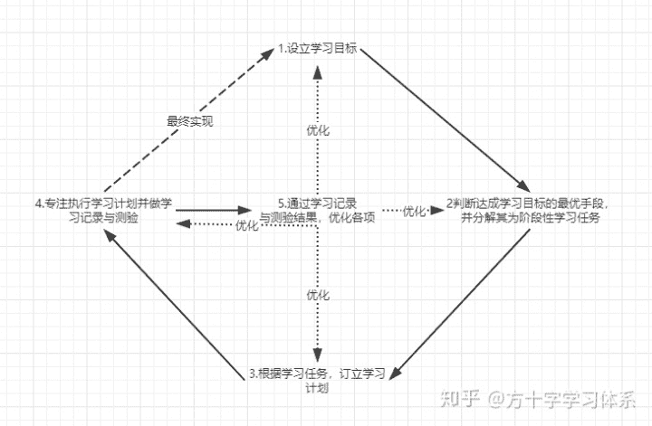
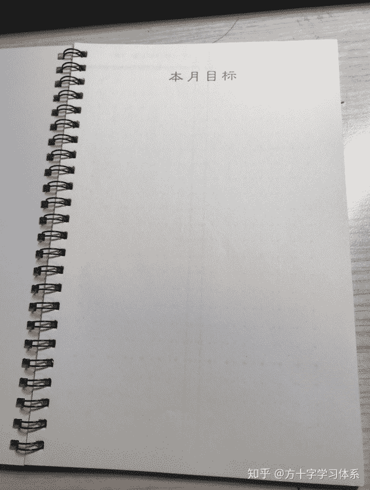
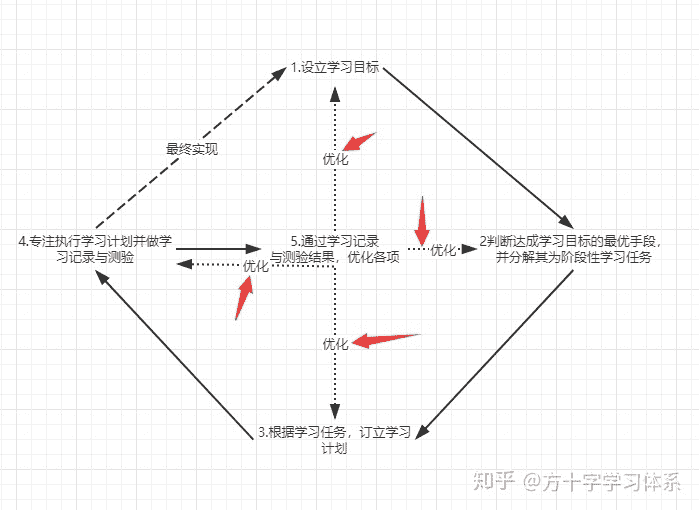
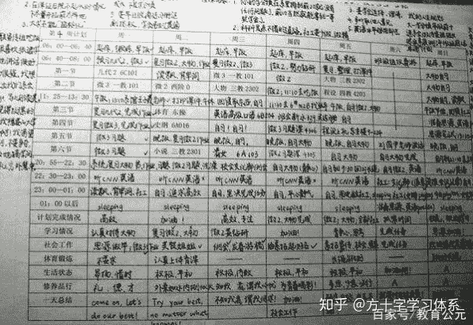
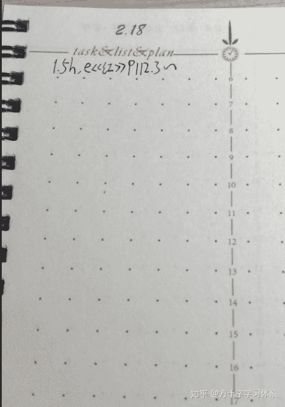
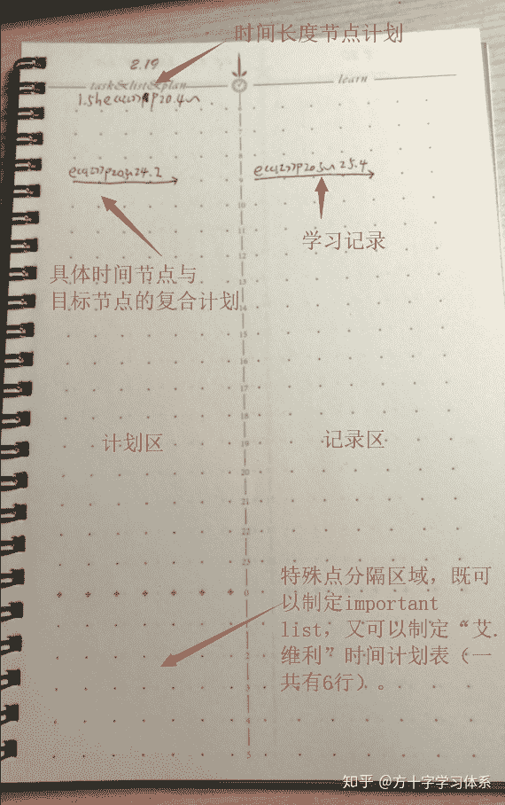
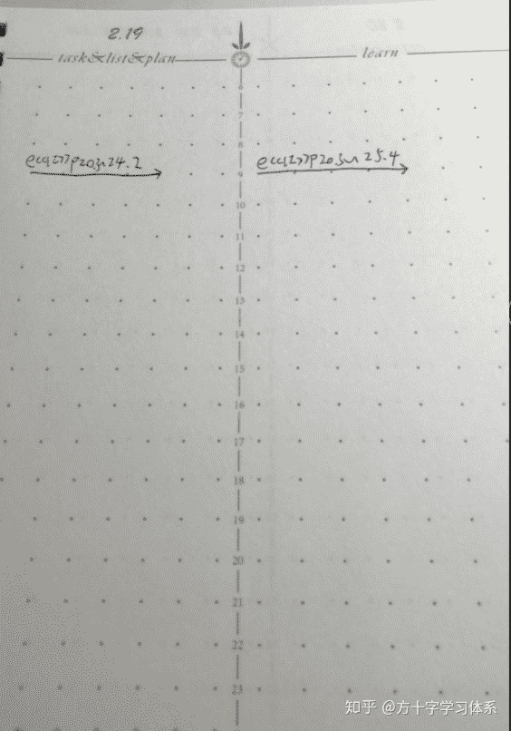

# 方十字应试学习管理方案

> 原文：[https://zhuanlan.zhihu.com/p/115156085](https://zhuanlan.zhihu.com/p/115156085)

**不论我们是学习，工作，甚至盖楼，战争，其本质都是人类的实践过程，是人类将观念中的世界转化为现实世界的过程。**

而对于如何实践，人们形成了一套这样的方法论：

<figure data-size="normal"></figure>

应试学习，也是人们的一个实践过程。那么具体到学习，是一个什么过程呢？很简单呀，每个过程之前加上学习就好了：

<figure data-size="normal"></figure>

不谋全局者，不足谋一域。接下来，我们逐一分析一下这个实践体系中每一项的作用与制定方式。

> 注意了，下面这种重大目标的制定与分解，最好能寻找一位有经验的专业人士（比如有经验的老师，生涯规划师等）协助你完成。

## 1.设立学习目标

对于学习目标的设立，有两项需要注意：

*   遵循**“SMART”原则。**
*   区分**目标**与**手段**，找到**终极目标**。
*   **拆解大目标为小目标**。

**（1）遵循SMART原则**

这里以学习目标的设定为例，来讲解如何改造一个不合理的学习目标。

比如，我定的目标是“上个好大学”。那么我这个目标有什么问题呢？

首先，这条目标不具备“SMART”原则中的“S”原则，即“**Specific，明确的，具体的**”。“上个好大学”这个目标很好，但好大学很多，不同的好大学所需要做的准备完全不同，那么你就并不知道怎样才能上个好大学。根据“S原则”，我们把这个目标改为“我要高考考好，考进哈工大”，这样就明确了。

好，现在我们有了一个目标：我要高考考好，考进哈工大。这个目标符合了“S”，但不符合"M"原则，即"**Measurable，可衡量的**"。高考考好，有多好呢？我们需要一个具体的数据衡量。因此，我们查了哈工大的录取分数线：

<figure data-size="normal"></figure>

我们发现，想考进哈工大，高考卷大概需要拿650分左右。这样，目标就变成了一个可衡量的目标：我要高考拿到至少650分，考进哈工大。

假如我们刚上高一，那么我们要给这个目标订立一个时限，以使其满足"T原则（Time-bound，有时间限制的）"，这很简单，3年之后。

这样，我们的的目标就变成：3年之后，我高考至少要拿到650分，考进哈工大。

那么，你真的那么渴望考进哈工大么？3年之后，高考达到650分，考进哈工大，这个目标对你来说，可以实现么？

对应的是目标制定中的"Achieveable（可独立完成）"与"Rewarding（完成后有满足感的）"。

假如你完全不喜欢哈工大，那么该目标对你来说，就不符合"R原则"，而假如你只剩一个月就要高考了，你的分数在300分左右徘徊，那么考进哈工大，对你来说便不符合"A原则"。

那么，假如你就贼想去哈工大，非哈工大不可，并且有3年的时间可以充分学习，那么“**3年之后，高考达到650分，考进哈工大**”这个总目标便是一个合格的总目标，符合了"SMART”原则。

> ps.对于R，另一个解释是：R代表相关性(Relevant）。该特性更多的是应用于对目标的分解过程中，需要考虑各阶段性分解目标之间的关联，以及它们与总目标之间的关联。不要盲目设置与总目标无关的目标。

**（2）区分目标与手段。**

我们时常把目标与手段相混淆，多是把手段当目标，常常手段是具体的，目标是模糊的，或者没有目标。

比如这样一个“目标”：我要在半年内背3000个单词。

假如你是个意志力非常强大的人，你真的半年内背完了3000个单词，结果呢？似乎没什么结果，英语题该做错还是做错，也没办法和外国人交流。

为什么会这样？

因为**背单词是手段，而不是目的。**

你应该问：为了什么，我要背单词？

*   可能是想在提升英语的应试能力，阅读题的准确度更高。
*   可能是想跟外国人交流。
*   可能是想挑战一下自己，训练记忆力。
*   。。。

背单词，是你达成这些目的的手段（未必是最佳手段），带着这些目标去背单词，效果会更好。

但有时，目标和手段的确难以区分。这里**给大家一个思维框架，帮助大家识别目标与手段**，并找出潜在的更优手段：

1.  多问几个“为什么我要。。。”，直到问不下去为止，即达到了“终极目标”。
2.  到达终极目标后，根据自己的现实条件，回推最优路径。

> 举例说明，比如原“目标”是“半年内背下3000个单词”，那么，为什么我要半年内背下3000个单词？假如说，因为我要跟外国人对话。为什么我要跟外国人对话？因为我觉得跟外国人对话够装币，有优越感。为什么我要装币，有优越感？不为什么。这样就问不下去了，我的终极目标是想要装币，有优越感。
> 那么往回推，为了装独特的币，有独特的优越感，结合自己的现状，能和外国人对话是最好的方法么？假如对我来说是。那么，为了和外国人对话，背单词是最好的方法么？假如我是一个知乎子弟，结合我的条件，不是。最好的方法是直接去美国的亲戚家生活半年。这样，为了达成我们的真实目的，我们就找到了一个更优秀的方法。（当然，假如不是知乎子弟，直接刻意背单词一般来说也未必是最好的方法。更好的方法比如朗读，学美剧，甚至STEAM翻墙和外国人打游戏，都是可能会。）

**（3）拆解大目标为小目标**

当你有了明确的学习目标，比如“3年之后，高考达到650分，考进哈工大”，你便需要对这样的大的学习目标进行拆解。

为什么？

因为，你面对的这个大目标时间跨度太长，执行难度太大，你一下子会不知道该怎么做，更不知道我现在应该去做什么，明天应该学什么。

因此，你需要先将其拆分为多个小的学习目标，让每个小的学习目标看上去都有可实现的路径，然后，你通过集中精力，依次攻克每个小的学习目标，最终组合成大目标的实现。这样，就可以有效降低目标实现的难度。

<figure data-size="normal"></figure>

那么我们该如何拆解目标呢？

**首先，我们按空间来分解**：

想要考650分，每科要拿到多少分，每科要拿到这些分，哪些题要做对，想要做对这些题，都需要掌握哪些知识点。

这样我们就可以将“高考拿650分”这个总目标分解为“分别需要熟练掌握哪些具体的知识点”。

**然后，我们按时间来分解：**

比如你发现有500个知识点需要掌握，你计划2年内全部掌握，那么平均每年需要掌握250个知识点，平均每个月你需要掌握大概21个知识点，每周约5个。。。（当然，**前提既然是熟练掌握，那么知识点的一次学习，效果肯定不好，需要配合复习。而复习最好的工具之一，是艾宾浩斯记忆曲线，这个工具在后文会有所提及**。）

如此，当我们把学习目标分解的足够精细与精准，我们就需要把这些目标拆解为学习任务。

这里，建议把每个月的学习目标记录下来，以供参考。

<figure data-size="normal">

<figcaption>方十字记忆曲线学习日志</figcaption>

</figure>

> 学习动机，与制定学习目标是既有区别又有联系的两个概念。学习动机，是内在的追求，是存在于内心的终极需要，而制定学习目标，是把它写出来，是一个可视化的过程，好比电脑主机与显示屏的关系。没有学习动机，也就没有学习目标可供制定，有了学习动机，才能根据学习动机制定学习目标。同时，制定目标可以帮助学生更清晰，更深入的认识自己的学习动机，从而强化学生的学习动机。制定目标是表象，学习动机的存在是根本。学习动机决定了学习目标的制定，学习目标的制定反作用于学习动机。在没有学习动机的前提下，只顾研究如何制定学习目标，只顾形式主义的制定学习目标，便是无根之木，无源之水。试图片面的通过学习如何制定目标来建立学习动机，必然是归于失败的，这也是很多知乎文章分享了学习目标的很多制定方法，实则不能生效的根源所在。

## 2.制定学习任务

所谓制定学习任务，就是**把“具体的学习目标”转化为“实现学习目标的步骤”**。

比如你的阶段性学习目标，是你本周要熟练掌握某5个知识点，那么制定本周的学习任务，就是规划一下，为了熟练掌握这5个知识点，你需要学什么，怎么学，看哪些书，上哪些课，做哪些题，怎么复习。。。

这里，建议每周订立一个周任务清单，以供参考。

<figure data-size="normal">

<figcaption>方十字记忆曲线学习日志</figcaption>

</figure>

## 3.根据学习任务，制定学习计划

**计划，是实现目标的路径参考。除此之外，再无其他含义。**

**学习任务，就是你“应该做什么”，是单纯的根据目标拆解而来。而学习计划，则规划出了“具体怎么做”，为你的实际执行提供真正的重要参考。制定任务时，只考虑了对目标的拆解，而制定计划时，既要考虑到应做的任务，又要考虑到计划周期内自己具体的现实情况。**

一提到计划，好多同学的感觉是这样的：因为心血来潮/老师，家长要求，模仿学霸制定了计划表，甚至细致到了“几点到几点上厕所”，结果无法执行，挫败感强烈，因此而放弃定计划。

这种状况下，当学生处于在校学习的状态时，的确如叶老师所言，学校制定了一套教学计划，通过管理的方式推给学生，学生只需要被动执行。所谓的要求学生听课，记笔记，做作业，都在这一范围内。

当学生在家学习之后，由于学生不制定计划，乱学一气，这样的学习效果肯定不如在学校有计划的学，哪怕执行学校的计划是被动的。

**但学校所安排的学习计划，一定好么？**

一个学校数千名学生，每个学生的具体情况都不一样，目前的学校，实际上根本无法根据每个学生的具体情况，制定合理的学习计划**（比如老师不可能根据每个学生的具体情况给每个学生单独留作业）**，而是根据教育局的规定，过去的经验，或者全校学生大概的平均情况来制定教学计划。这样的计划，大概率是不适合大部分的学生个体的，只有少量学生个体可以从这样的学习计划中获益颇丰。

所以，对于学生来说，不论是在校学习还是在家学习，要想进一步提升，**一定要掌握自己制定合理学习计划的能力**。而**目前对于大多数学生来说，最大的两个问题，就是看不清计划与现实的关系**，从而陷入“**计划命令主义**”或“**计划无用论**”。

## 1.计划命令主义

**所谓的“计划命令主义”，就是认为计划是绝对的，不能更改的，必须执行的，现实必须与计划相符。如果执行失败，就是自己的能力不行/不自律/没毅力。。。**

**计划，是实现目标的路径参考。除此之外，再无其他含义。**

计划是什么，**计划就是一张地图。地图只有参考意义，但绝对没有命令的意义**。假如你按照地图走，突然前面有一个沟，地图上没画，那么你需要做的事情，应该是把沟在地图上标出来，并重新规划路线。**而不是不管这条沟，严格按照地图走，直接走进沟里；或者因为自己没按照地图穿过这条沟而谴责自己，这些都是荒诞的。**

> 哪怕是制定自己给自己的计划，学生们也默认计划是带有命令性的。为什么呢？实际上是因为目前学生在管教中所面对的命令，都是以计划的形式呈现的。比如老师留的课后作业，便是以计划形式呈现的命令。而且，当学生获得计划之后，往往老师，家长会进行监督，一旦偏离计划，老师，家长便会责备学生，久而久之，学生便认为计划是强制性的，一定要严格完成的，否则会遭受惩罚。即使某一天，计划是由学生自己制定，不存在外部管教，但学生的“计划命令主义”观念已经形成，一旦偏离计划，过去老师，家长的惩罚便会内化为学生自己对自己的惩罚。

## 2.计划无用论

**所谓的“计划无用论”，就是完全否定计划的价值，认为由于现实的不断变化，制定计划时无法充分预测到现实的变化，因而制定计划是浪费时间的，完全没有用的，无法执行的。从而完全抛弃计划。**

实际上，计划就是一张地图，即使是有卫星加持的百度导航，也可能会出错。但我们不能因为局部的模糊与错误，就否定地图整体的价值。因为，虽然地图可能会出错，但是，当目标确定，但前路不明时，拥有一张相对合理的地图做参考，总归好于没有地图的无头乱撞。

> 实际上，许多学生的“计划无用论”，是源于“计划命令主义的”。由于学生错误的认为计划是绝对的，命令性的，因此，当计划的执行出现一点偏差时，学生便认为整个计划的执行都是失败的。而由于制定计划的过程中，对未来预测的有限性，与现实（包括学生自己的身心状态）存在一定的不确定性，学生执行计划时，几乎一定会出现一些偏差，因此，学生便会不断的全盘否定自己对计划的执行，久而久之，便形成了“计划无用论”。其本质，便是把计划执行的局部偏差，在观念中放大为对整个计划的否定。

那么，正确的观念是什么样的呢？再次回到对计划的定义上：**计划，是实现目标的路径参考。除此之外，再无其他含义**。因此，**计划本身完全不具备命令性**（再无其他含义）**，计划本身只具备参考性**。计划是你的工具，你的地图，你的参谋，你的秘书，你的老朋友，绝对不是你的上司领导。**计划只能是向你提供建议，而无权命令你必须遵从它的指示。**

有人便会提出疑问，说，如果计划不具备强制性（命令性），那学生制定完的计划，一定不会去执行呀，学生制定再好的学习计划，最后肯定是玩手机去了，而不是执行学习计划。

这个疑问背后的思路，实际上便是试图用命令主义的管理，来强制学生执行学习行为。而在上文中，我们已经分析出了命令主义式的管理的局限性，以及不合理的管理所带来的危害。

<figure data-size="normal"></figure>

而学生坚定的不去执行学习计划，而是去玩手机，其背后的主要矛盾，一定是**矛盾1**，也就是“**客观上的学习需要，与主观上学习动机不足之间的矛盾**。”

当矛盾1作为主要矛盾时，试图通过在学生的观念中给学习计划增添命令性来强制学生执行学习计划，便是一个不合理的，不解决主要矛盾的，扬汤止沸的方案，其结果必然是适得其反，令学生陷入“计划命令主义”与“计划无用论”当中，从而对自己的学习能力产生消极评价，反而会更加削弱学习动机。

而当**矛盾1作为主要矛盾得到充分的解决之后**，**学生渴望学习，渴望在学习中取得良好的学习成绩**，那么学习计划作为一个有效的学习工具，即使不含有任何强制性（即**理论上，学生获得这个学习计划，也可以自由的选择不执行/瞎执行/有选择性的执行**），**只要学生能够正确的认识计划的参考性价值**，那么学生一定会选择合理的参考学习计划，执行学习行为，当在出现偏差的时候并不会谴责自己或机械的执行学习计划，而是随机应变，具体问题具体分析，并根据这次的偏差情况合理的优化手中的学习计划。

上述，便是一个合理的计划观。

当我们有了合理的计划观之后，**我们该如何制定学习计划呢**？

很多人在制定学习计划时，存在一个误区：**错把学习任务搬运作为学习计划**，结果参考意义不大，难以执行，为什么呢？

从上文我们可以发现，学习任务完全是由客观的学习目标分解而来。**学习任务本身的生成，并未考虑到目前学生的具体情况**，并未考虑到学生目前的执行能力能否胜任这样的学习任务。如果单纯的搬运学习任务为学习计划，那么这样的学习计划大概率与学生本身的情况是不匹配的。

> 以上文拆解出的任务为例：你的阶段性学习目标，是你本周要熟练掌握某5个知识点。比如客观上来说，掌握这5个知识点，需要把《53高考》从P10做到P30，但由于现阶段你尚未建立起足够强的刷题能力，以你的能力每天最多做1页题，也就是每周最多做7页题。此时你机械的搬运周任务来制定日计划，制定“每天要做3页题”这样的学习计划，便是不合理的。
> 但你的能力是不断进步的，所以初期你制定计划，每天根据自己的实际情况，做半页或一页题，并在做题过程中不断优化自己的做题方法，做题速度，知识熟练度。随着你的能力的提升，慢慢的你就能做到每天做3页题，甚至5页题，10页题。这时，你所制定的学习计划就可以与学习任务的内容类似，甚至超额完成。

所谓“**知己知彼，百战不殆**”，这种**以纯分解来的任务做的计划，便是只考虑到了学习目标这个“彼”，而没有考虑到自己实际情况这个“己”**。

一个合理的学习计划的制定过程，一定是既考虑到客观的学习任务，又考虑到当前自身的实际情况而制定的。学习任务是制定可执行的学习计划的参考，而非学习计划本身。

**那作为学生，应该如何合理的制定计划呢？**

相信很多学生制定过这样的计划：根据学习任务，制定很长远的计划，比如每天学XXX，或者接下来的30天，几点到几点做XXX，几点到几点做XXX。。。

这样的计划有什么问题呢？

首先，从**客观**上来说，你虽然能大致预测你今天的状态如何，会发生什么事情，但你难以预测一个月，一礼拜每一天的状态如何，每天会发生什么事情。**甚至你难以预测到明后天会发生什么事情**。从上文我们得知，合理的计划，既要考虑到任务需求，又要考虑到自己的实际状况。因为你无法对长时间的每一天建立有效的预测，你也难以得知每一天自己的具体情况，所以这样的长远计划一般是不具有合理性的。

而从**主观**上来说，结合大家思维中普遍存在的“计划命令主义”，这种长远计划**剥夺了我们的自由感。**

> 当我们的自由感受到威胁时，我们会努力去恢复它。——杰克·布雷姆《社会性动物》

大家想想，比如坚持50天，每天几点起床，几点到几点学什么，每天背多少单词，看多少课，玩多久手机。。。。如此这样繁杂的规定，会感觉自己的身心在很长时间以内都要被束缚，就像蹲监狱一样，因此就会**抗拒**，**拖延**，**不愿意开始**。是啊，**谁愿意开始蹲监狱呢**？

因此：根据计划的本质与学生的实际情况，我在这里推荐一个计划的制定时间尺度：

## 每天开始学习之前，制定当天的学习计划。制定完毕后，命令自己立即开始执行10分钟。10分钟结束后，自由决定是否继续执行。（制定计划是每天启动学习的仪式）

**不要去制定明天的计划，后天的计划，周计划，月计划，都不要。只在当天制定当天的计划。周有周任务清单，月有每月目标，就足够作为每天学习计划的制定参考了。**

> 注意，这里没有任何要求你早起制定计划的含义。只需要在你开始学习之前临时制定当天的学习计划即可。即使你下午3点起床，4点坐在书桌前，准备学到10点。那你也可以好好计划一下，接下来的6个小时要怎么分配。

那么每天的学习计划，具体的制定格式是什么呢？这个，我要放在下文，与“**学习记录**”这一概念一起讲，因为这两者是紧密关联的。

## 4.执行学习计划并做学习记录+日计划的制定格式+优化反馈

关于如何执行学习计划，**干就完了**，没什么好说的。

此处重点介绍一下“**学习记录**”这一概念。

学习记录可以作为学习计划的执行情况的“监控器”，是一个可以提供反馈信息的工具。为后续的复盘与优化提供重要参考。

实际上，学习记录特别简单，就像航海日志，飞行日志，实验记录一样，**学习记录就是记录自己的学习过程。**但不知道为什么，目前很少有人重视这一学习方法，包括在知乎中也很少见到。实际上，**做学习记录包括但不限于如下优点**：

1.  *直观了解自己每天学习时间的长短与分布，为学习计划的制定与学习时间的统筹优化提供重要参考。*
2.  *通过记录，可以测算自己的学习速度，比如做题的速度或背东西的速度，结合学习时间与学习任务，有助于制定出更符合自己实际情况的学习计划。*
3.  *以学习记录为参考，优化自己的学习策略并监控优化的效果。*
4.  *可以作为管理的依据，比如用于打卡群打卡等。*
5.  *主观上查看学习记录会有成就感等正向反馈。*
6.  *（方十字记忆曲线学习日志独有的功能）学习记录是按照艾宾浩斯记忆曲线做复习管理的必要前提。*
7.  *。。。*

那么学习记录怎么做呢？非常简单。

比如2020年2月18号，从15：10~15：50，你背了新东方红宝书的单词，从第112页的第三个单词开始背，背到了115页的第二个单词。假如你15：50结束学习，准备休息，那么在你休息之前，便可以拿出一个普通的本子做如下记录：

<figure data-size="normal"></figure>

这条记录中，“e”代表“english”，即学了英语。《红》代表《红宝书》，P112,3代表112页的第三个单词。

做这样的学习记录，不需要具体的记录下来，自己都学了哪些单词，只需要记录一下自己在哪里学的即可，类似于一个目录。记录只需要保证自己能看懂即可，至少在15天之后，当你重新查到这条记录时，可以还原出这条记录的完整含义，并复原当时的学习行为。

当然，如果使用的是**方十字记忆曲线学习日志**，记录时间的方式会较为独特：

<figure data-size="normal">

<figcaption>方十字记忆曲线学习日志</figcaption>

</figure>

> 这里右侧为记录区，中间的纵轴代表小时，记录区中的点阵，每排有7个点，每个点代表10分钟。因此，用画箭线的方式，即可表示时间，图示的时间便是：15：10~15：50 。当学习记录以这种形式记录后，相比于数字时间记录，可以更直观的看出当天的学习时间长短与在一天之内的分布。

**当你把每天每个小阶段的学习都做了记录之后，你便可以从记录中获得如下信息：**

*   了解自己每天总共能学多长时间。
*   了解自己经常在什么时间学习。
*   了解自己有多久没学习，在什么时间不学习。
*   了解自己的学习进度，结合学习时间，即可测算出自己某一项的学习速度，进而了解自己的学习能力。（比如在记录中，30分钟完成了50个单词的学习，20分钟完成了40个单词的学习，那么你就可以估算出，平均每分钟的学习你可以掌握大概1.7个单词，这就是你学单词的能力）
*   了解自己对每学科学习时间的分配
*   。。。

那这些信息有什么用呢？

## **当然有用了！**

## **这就是自己的具体情况，也就是在计划制定中，“知己知彼”中的“知己”呀！！**

**这些信息，也可以充分的解决学生们在制定计划时的一大痛点：**

由于不清楚自己每天几点开始学习，每天能学多长时间，自己的学习能力到底如何：比如不知道自己能做多少题，或能背多少个单词，因此盲目的制定出难以执行下去的计划。。。

**而当你有了这些信息之后，你便可以更加充分的了解自己的学习情况（包括学习时间长度，学习时间的分布，平均的学习速度，每个时间段内每学科的学习速度等），从而根据自己目前的学习情况，制定出更合理的计划。而当你执行计划并记录之后，你便可以根据记录，全面的了解自己对计划的执行，从而进一步优化自己的学习计划，以及时间分配，学习策略等具体的执行问题。甚至你可以根据自己的实际情况适当的调整学习任务，乃至学习目标。**

**这就是学习记录的优化反馈价值。**

<figure data-size="normal"></figure>

**那么，以什么格式订当天的学习计划比较好呢？**

不同人，计划管理的能力是不一样的。比如让一个从未使用过计划的小白去制定一个像学霸那样的时间作息表，小白很难去制定，执行。因为小白对自己的学习情况没有充分了解，学习习惯也尚未稳定建立。

<figure data-size="normal">

<figcaption>比如类似这样的作息表，对小白来说几乎完全没有参考价值。学霸是因为从小白成长为学霸，才用的这样的作息表，而并非因为用了这样的作息表，才成长为学霸。</figcaption>

</figure>

针对不同人不同的计划管理能力，我分了三个阶段：**小白期**，**习惯建立期**，**稳定期**。

## **1.小白期**

小白期的同学，既没有计划管理的经验，又没有稳定的学习习惯，也不清楚自己的具体情况。针对小白期的同学，我建议各位这样做日计划：

**大致参考学习任务的方向，不看任务的具体要求，计划一下“花多长时间，学什么，设置具体的学习内容，但不设置内容终点，只设置时间终点。”**

举个例子：比如今天是2月18号，我坐在书桌前准备今天的学习。我看了一下周任务清单，发现本周的任务是背红宝书的英语单词（**先不要在意任务要求你背多少单词，这就是只看方向，不看具体要求**），那么，我做出了如下计划：

<figure data-size="normal">

<figcaption>方十字记忆曲线学习日志</figcaption>

</figure>

注意了：**这条计划的含义是：我要今天总共要花1.5小时，背英语红宝书的单词，从112页的第三个单词开始背，背到哪算哪。**

**那么，小白期的同学为什么要以这种方式制定计划呢？**

**（1）为什么只参考学习任务的方向，不参考要求？**

一般来说，小白期的同学的学习能力不足，难以完成学习任务的要求，但小白期同学的学习能力会不断发展进步，所以这一阶段，不能强求小白达成学习任务，而是尽可能的通过执行学习了解与提升自己的能力。所以，**在参考学习目标与学习任务时，只参考方向，不参考要求。**

**（2）为什么要以时间长度作为计划完成的标志，节点？**

这条计划，本质上是**以时间长度为节点的计划**，也就是“**不管背多少个单词，只要背了1.5个小时，就算达成计划**”。除了以时间为节点的计划之外，还有：

*   **以目标的达成为节点的计划**。比如“计划今天背50个单词”便是以目标达成为节点：背下来这50个单词意味着达成计划。
*   **无节点计划**：比如：我计划今天背单词，做数学题，背课文。这就是无节点的计划。
*   **以具体时间为节点的计划**：比如“计划9：20~10：30，背英语单词”。这就是以具体时间为节点的计划
*   **复合计划：**比如“计划9：20~10：30，背50个英语单词”，便复合了具体时间节点和目标达成。同时满足“9：20~10：30我去背了英语单词”，以及“背下来50个以上的英语单词”，才算是完成这样的计划。

之所以给小白选择“以时间长度为节点的计划”，是因为相对于小白来说，**这样的计划在可控性与具体性之间取得了较好的平衡**。相对于无节点计划，更具有**可执行性**，相对于以具体时间为节点的计划，更具有**灵活性**，而相对于以目标达成为节点的计划与复合计划，更具有**可实现性**。

> 当然，由于小白的计划管理能力一般过弱，这种以时间长度为节点的计划往往也会出现较大的执行偏差，比如本来计划学1.5h的单词，最后因为种种原因，只学了0.5h。但我们要记住，计划不是命令，计划只是参考。那么，当明天，乃至以后制定计划的时候，小白便可以根据现实情况，更加合理的安排各项的学习时间。

（3）**为什么只设置具体内容，不设置具体目标**？

首先，设置出具体的学习内容是非常必要的。比如，你的计划就是“我要花1.5h学英语”，那么，学英语的什么呢？这就是模糊的，难以执行的计划。因此，**具体的计划出学习内容，是非常有必要的，也有助于立即启动，减少拖延**。

其次，因为**小白所要学习的知识都是未知的**，同时，**小白对自己的学习能力也没有充分的认识**。因此，小白根本无法预测自己在单位时间内的学习进度。同时，一个学习项目总体的平均难度一定，但阶段性的难度有难有易，这是小白无法把控的。因此，**若想让学习计划对于小白来说有足够的可执行性，现阶段就不要设置具体目标了**。而后期，**当进入稳定期后，学生对自己的学习速度有充分的了解，便可以计算出自己想要学完这些知识，需要花费大概多长时间。那么，对于那个阶段的学生来说，制定目标节点的计划，与制定时间长度节点的计划，便没有差别。**

> **对于小白，可能不知道自己每半个小时能背多少个单词。假如他的英语学习能力特别弱，实际上每半个小时只能背10个单词，但小白并不知道。看人家学霸每天背200个单词，便机械的照搬学霸的计划，计划自己每天要背200个单词。结果导致每天要花10个小时背单词，这显然是荒谬的。**
> **而对于稳定期的同学，在学习记录的帮助下，他知道自己每天最多能背2个小时的单词，现在每半个小时大概能背50个单词。那么对他来说，他计划今天背100个单词，与他计划今天背1个小时的单词，便是等效的。**

**除此之外，还有一个小问题：多条计划如何排布。**

一般来说，有如下排布方式：

*   随机排布
*   重要紧急度
*   容易度（先难后易，或先易后难）
*   要事优先（important list）
*   艾.维利时间管理法
*   。。。

不同的学生对于不同的计划项排布方案各有偏好，大家可以都尝试一下，然后采用自己最喜欢的执行计划的顺序。在“**方十字记忆曲线学习日志本**”中，可以兼容各种各样的计划排布与计划制定方式。

<figure data-size="normal">

<figcaption>方十字记忆曲线学习日志</figcaption>

</figure>

## **2.习惯建立期**

当你掌握上文的**学习记录能力**与**日计划的制定能力**之后，你便进入了习惯建立期。

在习惯建立期的过程当中，由于你较为熟练的掌握日计划的制定和学习记录能力，你一定已经初步的了解了自己的现状。比如自己一般的学习时间的长度，分布，自己的学习能力，学习速度等。而此时，你的学习能力随着你不断的学习，会有较快的增长。

在习惯建立期，你便需要**正视自己的学习能力与客观的学习任务要求之间的差距**，并作出改进。改进思路一共有三个：

**（1）认识到学习能力的自然进步。**

以数学题为例，同样的题型，第一次学习，或第一次碰见，可能需要花费很长时间才能学会。而对于你来说，第二次，第三次再碰见，你可能就可以很快的将题做出来。

对应到学习速度上，便是即使你什么都不改变，你数学做题的速度，也会是先特别缓慢，然后急剧加快，最后稳定在一个水平上。

那么，你就会意识到，当你计划数学题的学习时，你要做好心理准备：前期可能会大大的落后于学习任务要求，而中后期会不断的超额完成任务。

**（2）增加学习时间**

这是最直接的方法，一般来说，也是效果最差的方法。**一定要在合理的范围内统筹学习时间的安排，不能顾此失彼，更不能盲目的增加时间以追求阶段性的学习任务的完成。**过长的学习时间可能反而会导致学习效率的降低，最终导致学习效果不佳，而主观上来说，（非心流状态的）过长的学习时间会降低学习行为的体验，最终损害学习动机。

**（3）改进学习策略，创造有利条件**

这是大家需要额外学习思考的方法，一般来说，也是效果最好的方法。我们都知道：**学习效果=学习时间x学习效率**，而学习策略越适合你， 学习效率越高，学习时间一定，学习效果越好。在合理的认识到自己学习能力的自然进步的基础上，建立更加科学合理的学习观念与学习方法，是比盲目的增加学习时间更有效的方案。

除此之外，学习当中的所有环节都可以进行思考，优化，比如在哪学习，用什么文具学习，和谁学习(可以参考5W1H）等等细枝末节的问题，都可以进行优化，最终都会对学习效果的提升有帮助。这种优化过程，统称为“创造有利条件”

**别忘了，矛盾2是学生对高效完成学习任务的需求与学生现阶段较为零散，低效，模糊的学习策略之间的矛盾，而不是学习时间长短之间的矛盾。**

对于方十字的学习观与背后所包含的学习策略，分享在文末的文章链接中。知乎上也有很多大神分享了很多不错的学习策略，各位不要盲从，可以根据自己的实际情况参考试验。

当学生在这个阶段，通过不断的调整改进，使每天的学习计划逐渐符合合理的任务要求，不断深化对自己的学习情况的认识并不断优化自己的学习策略、时间安排后，学生会逐渐养成固定的学习习惯，学习情况也趋于稳定。这时，**可以通过“尝试预测”的方式来检验自己是否进入了下一个阶段。即尝试根据过往的记录和计划管理经验，来预测明天，后天，甚至一周之后，会在什么时间学习，每天学多长时间，学到哪里。如果可以稳定的建立起对明天，甚至一周之内的学习情况的预测，那么就说明已经进入了下一个阶段：稳定期。**

## **3.稳定期**

处于稳定期的同学，拥有了较为稳定的学习习惯，较为良好的计划管理能力，对学习任务要求与自己的具体情况都有较为深入的认识，掌握较为合适的学习策略。这一阶段，可采用的计划形式大大增加，同时，在充分认识计划的本质的前提下，也可以根据自己的实际需求，适当的制定更长期的计划，逐步形成类似“学霸作息表”那样的计划。

> 此处千万不能教条主义，要抓住问题的本质。采取“当天制定当天的计划”这一时间尺度，其本质是在于你难以建立起对一天之后的稳定预测。如果你的作息，学习规律非常稳定，那么如果你可以稳定预测你明天，后天，甚至这一周的每一天的具体状况，预测准确率非常高，那么你据此制定多天的计划，甚至一周，一个月每天的计划，便是合理的，有很强参考意义的。同时，客观上来说，计划时间跨度越大，出现偏差的概率也一定越大，这不可避免。此时，万万不可陷入“计划命令主义”与“计划无用论”的错误观念中，牢牢抓住“计划是学习实践的参考”这一理念，当出现偏差时，灵活应对，具体问题具体分析，并不断优化计划。

在日计划的制定中，依然可以遵循“小白期”的计划制定格式。但计划效果，已与小白期完全不同。由于对“敌我双方”充分了解，虽然格式相同，但计划对现实学习的掌控力更强，可以更好的实现更精细的学习任务。

除“小白期”的计划格式之外，也可以根据需求，制定“以具体时间为节点”的计划，甚至"复合计划"。

<figure data-size="normal">

<figcaption>方十字记忆曲线学习日志</figcaption>

</figure>

比如上图所示：**左侧是计划，右侧是实际的学习记录**。这里便是一个**复合计划**。计划了在2月19日的9：00~9：40，背完英语《红宝书》的20页第3个单词至24页第二个单词。而在实际的学习中，我在9：00~9：40这段时间内，背完了20页第三个单词到25页第四个单词，超额完成了计划。**制定这样的计划，一定是建立在我对自己的学习时间规律，英语单词的记忆速度，英语单词的学习任务等信息充分了解的前提下，才能有效制定并执行。**

**处在这个阶段，可以进一步优化学习策略。当学习时间相对于完成学习任务过分充裕时，便可以适当的缩减学习时间，增加健康的娱乐活动与休息。而充分的休息，又有助于提高学习效率，从而提升学习效果，进一步的缩短所需要的学习时间，进而步入“学神般的正反馈循环”。**

<figure data-size="normal">

<figcaption>大概这就是学霸吃好喝好玩好也能学好的原因吧</figcaption>

</figure>

上述，基本就是一个完善的**学习管理方案**，包含于**方十字的学习策略**中。